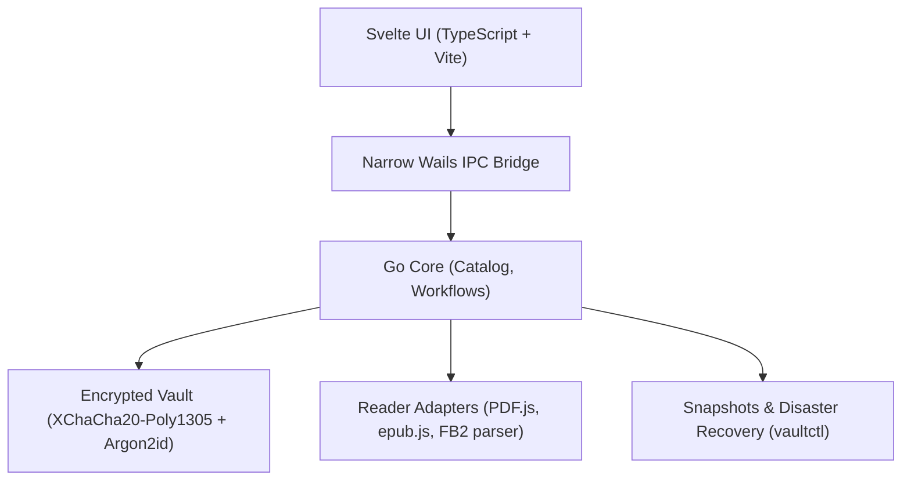

# Mut Reader

> **"Your library remains yours."**  
> Local-first encrypted archive. Backups and data portability strictly on your command. Zero clouds, zero telemetry, zero accounts.

[](https://opensource.org/licenses/MPL-2.0)
[](https://go.dev/)
[](https://ubuntu.com)

---

## Overview

**Mut Reader** is a fast, robust desktop application for Linux designed to store, organize, and read your personal book collection with an uncompromising stance on privacy, longevity, and data ownership.

Unlike cloud-dependent reading platforms and proprietary reader ecosystems, Mut Reader ensures that you retain full physical and cryptographic control over your digital library. Even if your OS is reinstalled, an online service shuts down, or network connectivity is completely severed, your books remain securely stored, organized, and reproducibly recoverable.

### Core Principles

- **100% Offline & Zero-Telemetry:** No background telemetry, no remote analytics, and no accounts or credentials sent over the network.
- **Encrypted at Rest:** Book files, cover art, titles, authors, shelves, notes, and reading progress are always encrypted on disk. When locked, the vault discloses zero book metadata.
- **Format-Agnostic Storage:** Store files of **any format** inside the vault. They are safely encrypted, deduplicated by byte content hash, and included in disaster-recovery backups.
- **Built-in Reading Adapters:** Native in-app reading experience for **PDF**, **EPUB**, and **FB2** in version 1. Other formats can be cleanly exported or launched via external system viewers.
- **Independent Disaster Recovery:** Data preservation is designed to outlive the application itself. An autonomous CLI tool (`vaultctl`) enables verifying and restoring library archives without launching the GUI.

---

## Architecture & Technology Stack



- **Core & CLI:** [Go](https://go.dev/) — pure packages without GUI dependencies located in `internal/`, accompanied by an independent `cmd/vaultctl` CLI.
- **Desktop Shell:** [Wails v2](https://v2.wails.io/) — lightweight native desktop integration via WebKitGTK without the overhead of Electron.
- **Frontend:** [Svelte](https://svelte.dev/) + [TypeScript](https://www.typescriptlang.org/) + [Vite](https://vitejs.dev/) — streamlined UI token system, list virtualization, keyboard-first navigation, and light/dark theme support.
- **Cryptography:**
  - **KDF:** `Argon2id` for deriving key-wrapping keys from passphrases.
  - **AEAD:** `XChaCha20-Poly1305` for authenticated encryption with associated data (AAD).
  - **Entropy:** Cryptographically secure random generator (`crypto/rand`).
- **Reader Engines:**
  - **PDF:** PDF.js (streaming byte-range reader to keep memory footprint bounded).
  - **EPUB:** epub.js in an isolated sandbox with scripts and external navigation strictly disabled.
  - **FB2:** Native streaming Go parser based on `encoding/xml` emitting sanitized HTML without invoking external C libraries.

---

## Vault Structure (`vault/`)

The repository uses a snapshot-based content-addressable model:

```text
vault/
├── vault.json            # Public header: format version, vault UUID, salt, KDF parameters,
│                         # wrapped master key (no book titles or secrets)
├── HEAD                  # Points to the latest valid snapshot ID (atomic commit)
├── objects/              # Encrypted blob objects (content, covers, notes)
│   └── ab/<random-id>
└── snapshots/            # Encrypted catalog trees (books, shelves, reading states)
    └── <snapshot-id>
```

---

## Repository Layout

```text
Mut/
├── cmd/
│   ├── app/              # Wails desktop application entrypoint
│   └── vaultctl/         # Standalone CLI tool for verification and recovery
├── docs/                 # Architectural Decision Records & Specs
│   ├── ARCHITECTURE.md   # Architectural boundaries, protocols, and data specs
│   ├── Bookreader.md     # Project scope, boundary rules, and non-goals
│   ├── PRODUCT.md        # User workflows, UI/UX specification, and design tokens
│   ├── ROADMAP.md        # Phased milestones (Phase 0 to 4) & Definition of Done
│   └── SECURITY.md       # Threat model, cryptographic target, and parser limits
├── internal/
│   ├── backup/           # Backup generation, verification, and restoration
│   ├── catalog/          # Catalog state, shelf management, and in-memory indexing
│   ├── importer/         # Format parsers and input boundary limits
│   ├── reader/           # Modular reader adapters
│   └── vault/            # Cryptographic primitives, storage objects, transactions
├── frontend/             # Svelte + TypeScript web app assets
├── go.mod
└── README.md
```

---

## Documentation

Full architectural decisions and design specifications are maintained in the [`docs/`](docs/) directory:

1. [docs/PRODUCT.md](docs/PRODUCT.md) — User personas, key workflows, UI design tokens, and non-commercial project principles.
2. [docs/ARCHITECTURE.md](docs/ARCHITECTURE.md) — Technical stack, storage schema, component boundaries, and reader architecture.
3. [docs/SECURITY.md](docs/SECURITY.md) — Threat model, security boundaries, cryptographic contracts, and parser fuzzing requirements.
4. [docs/ROADMAP.md](docs/ROADMAP.md) — Delivery phases (Phase 0 through 4), acceptance milestones, and Definition of Done.

---

## Development Prerequisites (Linux)

- **Operating System:** Ubuntu 22.04+ LTS / Debian 12+ / Fedora 39+
- **Go:** 1.23+ (or 1.27+ as specified in `go.mod`)
- **Node.js:** LTS (v18+ or v20+) & npm / pnpm
- **System Packages:**
  - `libgtk-3-dev`
  - `libwebkit2gtk-4.0-dev` (or `libwebkit2gtk-4.1-dev`)
  - `build-essential` / `gcc`
- **Wails CLI:** `go install github.com/wailsapp/wails/v2/cmd/wails@latest`

---

## License

This project is licensed under the [Mozilla Public License 2.0 (MPL-2.0)](LICENSE).
