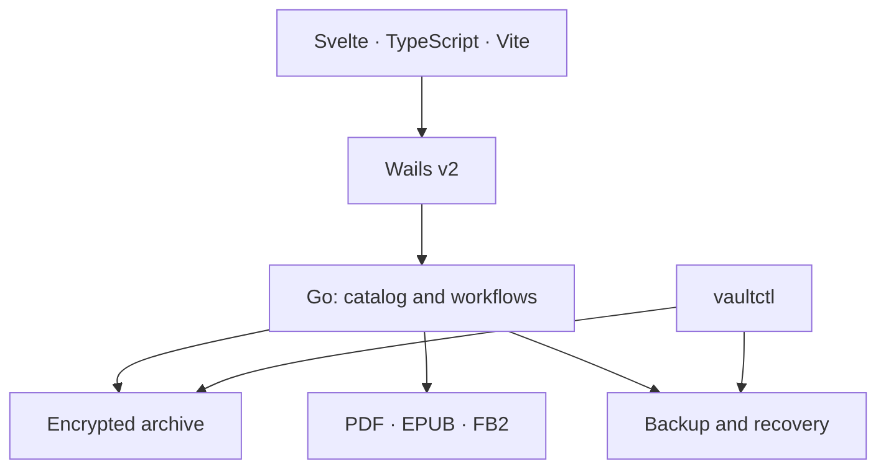

# mut

**A personal library. A quiet place to read. An archive you own.**

mut is a Linux desktop reader being built around a simple idea: your books should stay with you. Keep your collection in a local encrypted archive, organize it into shelves, and pick up where you left off. Backups, exports, and transfers happen on your terms.

> Your library remains yours.

Designed to work offline, without accounts or telemetry. Built first for the author and a small circle of friends, with careful attention to reading, data ownership, and long-term recovery.

## Project status

mut is an early prototype. This repository currently contains the project specifications and a Go vault package with code for creating, unlocking, and locking a vault, storing encrypted objects, and reading them back, alongside tests.

The desktop interface, book catalog, reading adapters, backups, and recovery CLI are planned. The features below describe the intended first release. The archive format is still under development; recovery testing and independent security review are required before a public release with data protection claims.

## The first release

- **Keep the whole collection.** Import files of any format. Read PDF, EPUB, and FB2 inside mut; keep other formats in the archive and export them for an external viewer.
- **Find your next book.** Shelves, covers, title and author search, and filters for books in progress or finished.
- **Read comfortably.** A calm reading view with a table of contents, bookmarks, saved positions, keyboard navigation, and light and dark themes. Adjustable text for EPUB and FB2; page zoom for PDF.
- **Lock the library.** Book contents, titles, covers, notes, and reading progress are intended to remain encrypted on disk when the vault is locked.
- **Make a copy you can trust.** Encrypted backups, integrity reports, and restoration on a clean machine. A standalone `vaultctl` utility is planned for verification and recovery without the desktop app.
- **Take your originals with you.** Export the files you imported, without tying them to the library's internal format.

Storage and reading are separate: a missing reading adapter should never prevent a file from being preserved.

## Under the hood

The planned architecture keeps the desktop interface separate from the storage core. The application and recovery CLI will share the same Go packages.



The vault prototype uses **Argon2id** and **XChaCha20-Poly1305** from `golang.org/x/crypto`, with **HKDF** for object keys. The storage design calls for encrypted content and metadata, an in-memory search index after unlocking, and catalog snapshots committed through an atomic `HEAD` update.

The planned reading engines are PDF.js, epub.js as the EPUB candidate, and a streaming FB2 parser written in Go. Interface assets and reader resources will ship with the application; book scripts and external requests are to be disabled.

See the [architecture](docs/ARCHITECTURE.md) and [security model](docs/SECURITY.md) for the design, boundaries, and review requirements.

## Documentation

The detailed specifications are written in Russian.

| Document | Contents |
| --- | --- |
| [Project brief](docs/Bookreader.md) | The idea, core decisions, and scope of the first release |
| [Product and interface](docs/PRODUCT.md) | User workflows, navigation, and visual design |
| [Architecture](docs/ARCHITECTURE.md) | Stack, component boundaries, archive design, and contracts |
| [Security](docs/SECURITY.md) | Threat model, key handling, and required checks |
| [Roadmap](docs/ROADMAP.md) | Milestones from prototype to beta and acceptance criteria |

Start with the project brief, then follow the product, architecture, security, and roadmap documents.

## Repository

```text
.
├── docs/              # project decisions and specifications
├── internal/vault/    # encrypted storage prototype and tests
├── pictures/          # project artwork
├── references/        # visual references
├── go.mod
├── go.sum
└── README.md
```

The Go version declared in `go.mod` is **1.27.1**. To run the core tests:

```sh
go test ./...
```

Desktop setup instructions will be added with the Wails application and frontend scaffold.

## What's next

The first milestone is a complete, verifiable round trip: create a vault → store files → close and reopen → back up → restore into a new directory → compare the original bytes. The reading interface, shelves, and larger collections follow that foundation.

Later ideas include sharing book lists and personal notes, selected encrypted packages for specific recipients, and local search with citations. Their scope is documented separately in the roadmap.

## License

**MPL-2.0** is the proposed license. A license file has not yet been added; the final choice and dependency licenses must be reviewed before the first public release.
