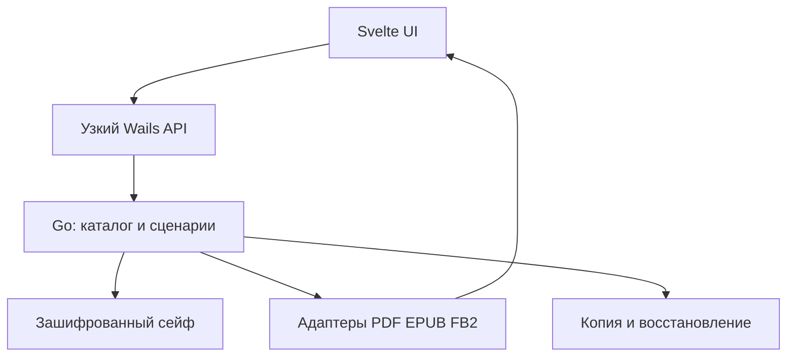

# Архитектура и стек

Статус: ADR-001, проектное решение для прототипа. Формат архива ниже — целевая схема, **не** утверждённая криптографическая спецификация. Её реализацию и миграцию проверить независимым ревью до публичного релиза.

## Почему такой стек

| Слой | Решение | Причина / ограничение |
| --- | --- | --- |
| Приложение | Go, Wails v2, встроенные локальные ресурсы | Go остаётся основным языком; Wails v2 — стабильная ветка, v3 пока beta; системный WebKitGTK обязателен на Linux. |
| Интерфейс | Svelte + TypeScript + Vite, обычный CSS с токенами | Хорошие интерактивные состояния и дизайн без тяжёлого UI-комбайна; JS/TS нужен лишь для окна и ридеров. |
| PDF | PDF.js, ресурсы включены в пакет | Проверенный отображающий движок; загрузка байтов из Go через узкий мост, без удалённых URL. |
| EPUB | epub.js как кандидат, короткий security spike | Рендеринг, оглавление, позиция; скрипты книги отключены, активный контент изолирован. При провале изоляции заменить адаптер до запуска. |
| FB2 | Go `encoding/xml` (потоковый разбор) + собственный безопасный HTML-вывод | Без C и внешнего конвертера; в UI только разрешённые теги/атрибуты, без сырого XML/HTML. |
| Хранилище | Зашифрованные объекты + метаданные на диске, поисковый индекс в памяти после разблокировки | При закрытом сейфе названия, обложки и заметки отсутствуют в открытом виде. SQLite допустим лишь для эфемерного индекса в памяти, если понадобится. |
| Криптография | `golang.org/x/crypto/argon2` Argon2id; `golang.org/x/crypto/chacha20poly1305` XChaCha20-Poly1305 | Примитивы из поддерживаемых Go-библиотек, собственный протокол лишь после ревью. |
| Обмен позже | Совместимый с age зашифрованный пакет для получателей | Отдельный переносимый файл, а не выдача ключа от всего сейфа. |
| Упаковка | Сначала .deb для Ubuntu LTS, затем AppImage/Flatpak после совместимого smoke test | Для Wails v2 нужны версии GTK3/WebKit2GTK, зависящие от дистрибутива; матрицу фиксировать в CI. |

Проверенные источники: [Wails v2](https://v2.wails.io/docs/introduction/), [Linux-зависимости Wails](https://wails.io/docs/guides/linux-distro-support), [PDF.js](https://mozilla.github.io/pdf.js/), [epub.js](https://github.com/futurepress/epub.js), [Argon2id](https://pkg.go.dev/golang.org/x/crypto/argon2), [XChaCha20-Poly1305](https://pkg.go.dev/golang.org/x/crypto/chacha20poly1305), [age](https://github.com/FiloSottile/age).

## Компоненты и границы



Интерфейс вызывает именованные методы (`CreateVault`, `Unlock`, `ImportBooks`, `ListBooks`, `OpenBook`, `ReadRange`, `SavePosition`, `ExportOriginal`, `OpenExternally`, `CreateBackup`, `VerifyBackup`, `Restore`, `Lock`), получает только данные текущего разрешённого сеанса. `ExportOriginal`/`OpenExternally` доступны для любого объекта независимо от наличия адаптера чтения и всегда создают явно незашифрованную копию во временном или выбранном пользователем месте — см. SECURITY.md о том, что это не пытается быть безопасным по умолчанию. Go проверяет каждое действие и идентификатор; UI не получает произвольные пути файловой системы. Потоки просмотра выдаются лишь для выбранной книги и прекращаются при блокировке. Отключить удалённую навигацию, не загружать CDN/внешние шрифты/обложки. Не вводить локальный HTTP-сервер без доказанной необходимости; если он понадобится для PDF/EPUB, привязка только к loopback, случайный токен сеанса, строгие заголовки, запрет доступа к произвольным путям и отдельный security review.

Каталог — данные, ридер — сменный адаптер. Позиция EPUB хранится как CFI с запасным указателем главы; PDF как номер страницы и положение; FB2 как ID раздела/абзаца. Форматно-зависимые указатели версионируются. PDF.js и epub.js могут требовать крупные буферы в webview: большой PDF открывать порциями/диапазонами после измерения памяти, а не копировать несколько полных экземпляров в мост.

## Формат сейфа v1 (проект)

```
vault/
  vault.json                 # только версия, идентификатор, соль и параметры KDF,
                             # обёрнутый случайный главный ключ; без названий книг
  HEAD                       # ID последнего завершённого снимка, без названий
  objects/ab/<random-id>     # зашифрованные книги, обложки, записи метаданных
  snapshots/<random-id>      # зашифрованный каталог ссылок и ревизий
```

1. Создать случайный 256-битный главный ключ средствами системного CSPRNG. Пароль через Argon2id с уникальной солью создаёт ключ обёртки; параметры записываются в `vault.json`, подбираются замером на целевых машинах и могут обновляться. Смена пароля переобёртывает главный ключ; при потере пароля и recovery key данные недоступны. Вариант recovery key — отдельный заранее созданный, пригодный для печати секрет с проверкой восстановления.
2. Каждый логический объект получает непредсказуемый ID и отдельный ключ, выведенный из главного ключа через утверждённый KDF и контекст (`vault-id`, тип, версия, object-id). Большие книги шифровать независимыми блоками с отдельными nonce; AEAD связывает версию формата, ID, тип, индекс блока и ожидаемую длину как authenticated associated data. Формат и доменное разделение проверяются тестовыми векторами.
3. Зашифрованный snapshot содержит реестр книг, форматов, метаданных, полок, позиций и ссылок на blob-объекты. Изменение: написать новые объекты и snapshot, синхронизировать на диск, атомарно заменить `HEAD`. До успешной замены старая версия читаема. Очистка невостребованных объектов — отдельная безопасная операция после успешной копии.
4. В закрытом состоянии нет открытых названий, обложек и истории поисковых запросов. После разблокировки построить индекс названий и авторов в памяти; при росте коллекций профилировать и рассмотреть зашифрованный кэш индекса. Не писать открытые thumbnails, дампы, логи и временные PDF/EPUB.
5. Блокировка сбрасывает сеансовые ссылки и очищает управляемые буферы best effort; ОС, swap и webview могут сохранять следы в памяти. Для защиты выключенного ПК рекомендовать полнодисковое шифрование. Нельзя обещать гарантированное стирание из памяти.

Важное техническое решение прототипа: нагрузочный тест snapshot при 10 000 книгах и 100 000 заметках. Если запись каталога слишком дорога, перейти к сегментированным зашифрованным записям до заморозки формата, сохранив атомарный корневой snapshot. Не менять формат молча после релиза.

## Импорт и чтение

Импорт — это два независимых шага, и второй шаг может отсутствовать без ошибки первого:

1. **Сохранение (формат-агностично, всегда).** Любой файл — независимо от расширения — записывается как зашифрованный объект (имя, размер, расширение, хеш исходных байтов, MIME по сигнатуре, если распознан). Этот шаг не парсит содержимое файла и потому не расширяет площадь атаки: неподдерживаемый для чтения формат просто лежит как blob, как и любой другой файл, который пользователь решил положить в сейф. Дубликат определяется хешем исходных байтов, хранящимся только внутри зашифрованных метаданных. Несколько форматов одной книги связывать вручную в первой версии.
2. **Выбор адаптера чтения (опционально).** Каталог смотрит на расширение/сигнатуру и подбирает `Reader` из зарегистрированных адаптеров (сейчас PDF/EPUB/FB2). Если подходящего адаптера нет — это не ошибка импорта, а обычный статус объекта `NoReaderAvailable`; UI показывает карточку «нет встроенного чтения» с действием «экспортировать/открыть внешне» (см. PRODUCT.md, сценарий 4). Все форматы, для которых адаптер всё же существует, считаются недоверенным вводом: лимиты распаковки, числа записей, глубины XML, размера обложки и времени обработки; проверять сигнатуру, не следовать внешним ссылкам и скриптам. Задачи импорта отменяемы.

Существующие адаптеры чтения:

- PDF.js отображает страницы; не обещать OCR или полное выделение текста в сканах.
- epub.js получает контент только локально; `allowScriptedContent` остаётся false, ссылки наружу не открываются автоматически. Проверить CSP и iframe sandbox на реальной сборке WebKitGTK. Книги с активным EPUB-контентом показывать в безопасном упрощённом режиме либо отклонять.
- FB2: XML декодировать с лимитами, сопоставить ограниченный набор элементов с внутренней моделью `BookDocument`; изображения встраивать только из проверенного контейнера, никаких remote resources.

Кандидаты на новые адаптеры (после v1, по одному за раз, с собственным тестовым корпусом и лимитами — см. ROADMAP.md): MOBI/AZW3 без DRM, CBZ/CBR, DjVu, TXT/Markdown, DOCX как текст. Формат, защищённый DRM конкретного магазина (Kindle AZW с шифрованием, Adobe-EPUB), в адаптеры не включается ни на одном горизонте — такие файлы остаются в статусе «нет встроенного чтения» намеренно, а не временно.

## Копия, целостность и переносимость

Резервная копия — согласованный snapshot плюс все достижимые зашифрованные объекты, с манифестом контрольных сумм ciphertext. После записи приложение перечитывает копию и сравнивает хеши. Восстановление на чистой машине дополнительно расшифровывает метаданные и выборку/все объекты для проверки AEAD; полная проверка доступна явной командой. Резервирование не зависит от платной учётной записи. Две копии на разных носителях, одна вне основного устройства; периодическая проверка. Публично описать формат и предоставить маленькую автономную Go CLI `vaultctl verify` / `vaultctl restore` до релиза 1.0.

Нельзя надёжно заметить откат на старый корректный snapshot, если злоумышленник может заменить *весь* локальный сейф. Для истории нужны внешняя доверенная копия/журнал; в v1 показывать даты/ID копий и сравнивать их, без заявления об абсолютной защите от отката.

## Кодовая структура

```
cmd/app/               # окно Wails и внедрение зависимостей
cmd/vaultctl/          # автономная проверка и восстановление
internal/vault/        # ключи, формат, транзакции, объекты
internal/catalog/      # книги, полки, позиции и поиск
internal/importer/     # pdf/epub/fb2 + лимиты
internal/backup/       # снимок, проверка, восстановление
internal/share/        # позже: капсулы
internal/ai/           # позже: локальный интерфейс модели
frontend/src/          # Svelte компоненты и стили
spec/                  # версия формата, векторы, миграции
```

Go-пакеты не должны зависеть от Wails: CLI и тесты используют то же ядро. Рендереры изолированы адаптерами; фронтенд не содержит криптографических ключей дольше необходимого и не владеет мастер-ключом. Контракт фронтенда генерируется из Go типов; ошибки содержат пользовательское сообщение и машиночитаемый код без путей/содержимого книги в логах.

## Производительность и поставка

Профилировать холодный запуск, импорт 1/100/1000 книг, разблокировку 10 000 записей, память при PDF 500 МБ, работу на слабом ноутбуке и на HiDPI. Избегать удержания полного PDF в Go и JS одновременно. Thumbnail и парсинг — фоновые ограниченные очереди; UI виртуализирует сетку. Релизные сборки повторяемые по lock-файлам; SBOM, подпись артефактов, обновление с проверкой подписи после v1, проверка лицензий зависимостей.
