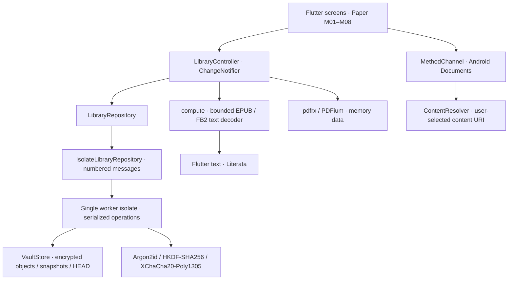

# ADR-002 · Android на Flutter

Дата: 1 октября 2026. Статус: реализованный прототип. Пользователь явно расширил исходный Linux-only scope из `docs/Bookreader.md`; desktop-стек Wails/Svelte остаётся отдельным клиентом. Этот ADR применяется к `mobile/` и наследует продуктовые и security-принципы документации корня.

## Компоненты



`lib/domain/` содержит модели и контракт без зависимостей от Flutter. `lib/data/` реализует криптографию, файловые транзакции, ZIP-проверки и декодеры. `lib/app/` владеет сеансом, busy-состоянием и навигацией. `lib/features/` содержит экраны и конкретные пользовательские сценарии. `lib/ui/` — точные дизайн-константы и повторяемые элементы. `lib/platform/` — узкий Android-канал; Kotlin находится в `android/app/src/main/kotlin/`.

Внедрение зависимостей — через конструкторы. Отдельный state-management пакет не нужен: одна библиотека/пользователь, `ChangeNotifier` и неизменяемые `Book`. Тесты подменяют `LibraryRepository` и `Documents`; рабочий запуск всегда использует encrypted repository. Не используются глобальная service locator, локальный HTTP-сервер или webview.

## Почему Dart-адаптер сейчас

Go остаётся desktop-ядром, но текущие пакеты ещё не имеют законченного Android-bindings API: snapshot write есть, backup/restore и полный каталог не завершены. Подключение gomobile сейчас связало бы сборку Android с незавершённым ядром. В мобильном вертикальном срезе реализован Dart-адаптер через поддерживаемую `cryptography`, а не собственные криптографические примитивы. Контракт репозитория позволяет позже заменить его на Go/JNI, сохранив UI.

Независимый генератор `tool/go_vectors.go` использует `golang.org/x/crypto`, те же параметры/байты, что текущий `internal/vault/crypto.go`. `crypto_compatibility_test.dart` проверяет Argon2id, HKDF, обёртку master key, XChaCha20-Poly1305 и Unicode plaintext. Это свидетельство совместимости примитивов, не заморозка формата или замена ревью.

## Архив и транзакции

В приватном application support каталоге Android:

```text
vault/
  vault.json               # version, UUID, KDF, wrapped master; mobile recovery extension
  HEAD                     # UUID завершённого snapshot
  objects/ab/<uuid>        # nonce(24) | ciphertext | tag(16)
  snapshots/<uuid>         # тот же encrypted envelope
```

Master key — 32 случайных байта CSPRNG. Production KDF наследует Go-прототип: Argon2id, 64 МиБ, 3 итерации, 4 lanes, salt 32 байта. Параметры при открытии ограничены до затрат KDF. Вектор и unit-тесты используют отдельно уменьшенные параметры, которые не применяются в приложении.

Ключ объекта: HKDF-SHA256(master, salt=UTF8(vault UUID), info=UTF8(`mut:object` + object UUID)); AAD — object UUID. Обёртка master key использует vault UUID как AAD. Это текущая схема Go, ещё без будущего type/version/block domain separation из ADR-001.

Recovery — независимый случайный 256-bit secret, его XChaCha20-Poly1305 envelope хранится в дополнительном `mobile_recovery`, AAD=`vaultUUID:recovery`. Открытие требует кода, не сервера; смена пароля меняет обёртку, а не master. Старые backup сохраняют свой старый пароль. Старый Go-header не имеет mobile recovery, поэтому соответствующий сценарий сообщает о его отсутствии.

Импорт: hash исходных байтов → обнаружение дубликата → запись ciphertext с новым UUID → новое состояние каталога → encrypted snapshot → `HEAD`. Temp-файлы содержат только ciphertext или неприватный header/UUID. Не удаляем исходники или недостижимые объекты автоматически. Ошибка до `HEAD` оставляет предыдущий каталог доступным и, возможно, неиспользуемый ciphertext.

Worker последовательно исполняет все запросы; UI не может устроить одновременные snapshot writes. Ответ связан с numbered request. Ошибки возвращаются кодом и безопасным сообщением без оригинала или путей. UI не получает master key; plaintext выбранной книги необходим только ридеру/явному экспорту.

Удаление: `LibraryRepository.remove` → worker → копия каталога без записи книги → encrypted snapshot → `HEAD`. Книга и её прогресс/закладки исчезают только после commit. `read` больше не разрешён для удалённого ID; hash больше не мешает повторному импорту. Новые backup включают только достижимые объекты. Исторические snapshot и недостижимый ciphertext сохраняются до отдельного GC; исходники и прежние backup не изменяются.

## Сеанс, блокировка и Android

При уходе в background, native `onStop`, ручной блокировке или 5 минутах без взаимодействия controller сразу скрывает метаданные и ридер, увеличивает generation и посылает `Lock` в isolate. UI проверяет generation после асинхронного чтения/декодирования/разблокировки: поздний ответ не открывает книгу заново. Модальные окна закрываются. Worker обнуляет доступный master buffer, UI обнуляет PDF byte buffer; освобождение остальных runtime-копий — best effort.

Для явного SAF-перехода shell ставит document-flow flag, а native activity держит pending operation: системный picker не выглядит как забытый в фоне открытый архив. Flutter показывает неприватную заставку при inactive; `FLAG_SECURE` запрещает recents/screenshot содержимого activity. Таймер блокировки продолжает работать, поэтому долгий выбор не продлевает сеанс бесконечно. Перезапуск процесса всегда требует нового открытия.

`ACTION_OPEN_DOCUMENT` читает выбранный URI ограниченным буфером в worker executor Kotlin, без копии в cache. `ACTION_CREATE_DOCUMENT` пишет явный экспорт или ciphertext backup; для backup ContentResolver повторно читает выбранный URI и сравнивает SHA-256. Cancel не сообщает об успехе. Нет `READ_EXTERNAL_STORAGE`, `MANAGE_EXTERNAL_STORAGE`, INTERNET в основном manifest, аккаунтов, сервиса синхронизации или телеметрии. Debug manifest Flutter может иметь INTERNET для инструментов разработки; release не зависит от него.

Android Auto Backup отключён: копирование архива делает только пользователь. APK не включает пользовательские книги/ключи; Onest/Literata и логотип — локальные assets.

## Ридеры и память

EPUB ZIP сначала проверяет central directory: count, expanded sizes, отсутствие split/ZIP64/encrypted ZIP, повторов имён и traversal. Затем сверяет local headers и границы файлов, запрещает symlinks и пересечения; распаковывает stored/deflate через ограниченный chunked sink `dart:io` и независимо проверяет CRC-32. Ложный declared size не отключает лимит распаковки. OPF spine определяет порядок; повторные ресурсы пропускаются, суммарный текст ограничен 32 МиБ. XHTML не исполняется: выводится разрешённый текст p/blockquote/li. DTD/entity declarations, script/style/object/iframe исключены, remote resources не загружаются. XML ограничен 8 МиБ, 100 000 nodes, depth 64; ZIP 64 МиБ / 2048 entries. FB2 ограничивает ту же XML-модель. Сложные иллюстрированные и DRM-книги не обещаны.

PDFium получает проверенные memory bytes, не URI/путь. Автоматические URL-ссылки отключены, рендерный cache ограничен 32 МиБ. PDF может масштабироваться, но не переразмечивается. Натальная реализация PDFium не запускает webview; тестирование PDF корпуса и измерение native memory остаются до beta.

Текстовая позиция — `text-v2:chapter:characterOffset`, PDF — `pdf-v1:page`. Старые `text-v1:chapter:scrollFraction` позиции и закладки приблизительно пересчитываются. Позиция debounce 600 ms плюс flush при выходе/блокировке; экран скрывается до записи и ошибка записи не мешает блокировке. Сохранение позиции обновляет модели без общего `notifyListeners` и повторного чтения каталога. Bookmarks и настройки Literata/размера/интервала/цвета/режима хранятся в encrypted snapshot.

`features/reader/text_pagination.dart` измеряет текст `TextPainter` с фактической шириной, высотой, TextScaler и Literata, обрабатывает не более 2048 UTF-16 units за измерение и уступает event loop между порциями примерно каждые 4 ms. Незавершённый расчёт отменяется при смене вёрстки или закрытии. Дескрипторы страниц содержат главу, смещение и фрагменты. `PageView.builder` / `ListView.builder` строят только видимые страницы; смена режима использует уже рассчитанную карту. Для EPUB/FB2 число страниц относится к текущей вёрстке. PDF открывается один раз и используется обоими режимами: `PdfPageView` + `InteractiveViewer` для страниц, `PdfViewer` для ленты; память копии PDF и cache ограничены текущим лимитом файла/32 МиБ. Документ освобождается при закрытии, позднее открытие после закрытия также освобождает native document.

Поиск — фильтрация разблокированного каталога в памяти. Сетка строится лениво; первоначальная пагинация, snapshot, поиск и whole-object memory требуют профилирования на Android перед масштабированием. Unit/widget-тесты с Linux PDFium не заменяют измерение задержек и native memory на телефоне.

## Backup/restore

Создаётся архив из текущих `vault.json`, `HEAD`, одного snapshot и достижимых object files. Манифест SHA-256 относится к ciphertext. ZIP проверяется до отправки в SAF; сохранённый документ перечитывается платформой. Restore проверяет checksum manifest и допустимые paths → пишет staging рядом с vault → открывает там header → проверяет AEAD каждого оригинала и исходный hash, если есть → переносит текущий vault в `vault.previous` → атомарно переносит staging в vault. До полной верификации действующая библиотека не меняется.

Crash между directory renames обрабатывается при запуске: если vault отсутствует, а previous существует, возвращается previous. Незавершённый staging не принимается за действующую библиотеку. Предыдущие зашифрованные данные сохраняются; повторная замена требует отдельного управления previous, которое ещё не входит в UI.

## Следующие инженерные этапы

1. Потоковый chunked формат с доменным разделением и versioned locators, ревью + bilateral full-vault vectors.
2. Отдельное управление recovery/previous, настоящий EPUB CFI, изображения/обложки с ограничениями, массовый отменяемый импорт.
3. Crash/fuzz tests, offline network audit APK, PDF корпус, нагрузка 10 000 books, device timings KDF и памяти.
4. Signed release, SBOM, проверка лицензий, независимое security review по `docs/SECURITY.md`.

Исходные документы: [продукт](../../docs/PRODUCT.md), [security](../../docs/SECURITY.md), [desktop ADR](../../docs/ARCHITECTURE.md), [roadmap](../../docs/ROADMAP.md). Использованные API: [Flutter architecture](https://docs.flutter.dev/app-architecture/guide), [cryptography](https://pub.dev/packages/cryptography), [pdfrx](https://pub.dev/packages/pdfrx).
